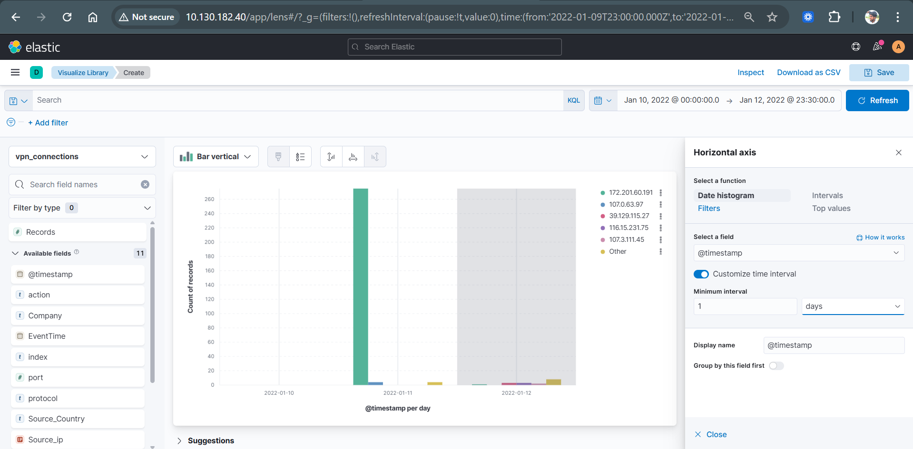
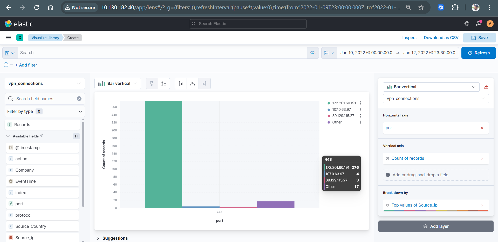
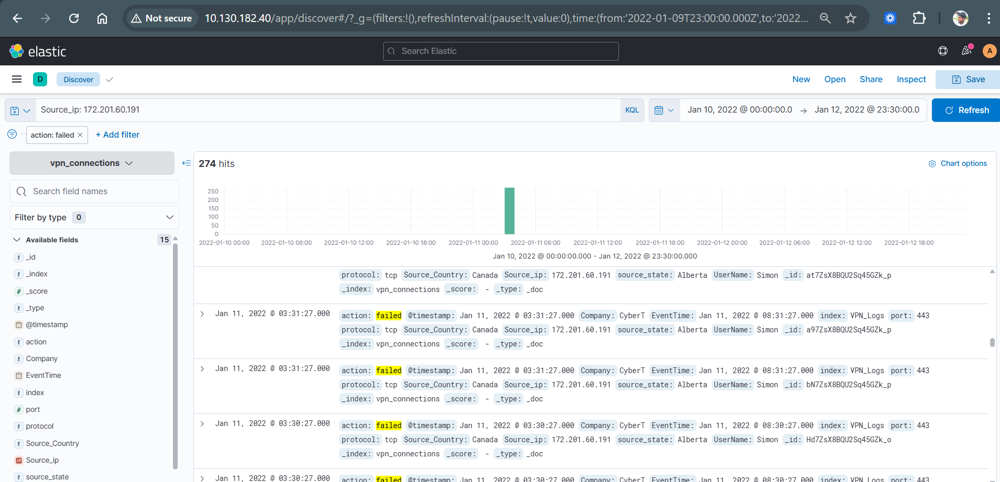

# Brute Force Attack Detection using ELK Stack (SIEM Project)

## Project Overview

This project demonstrates a **SOC (Security Operations Center) investigation** using the **ELK Stack (Elasticsearch, Logstash, Kibana)** to detect and analyze a **brute-force attack** targeting VPN authentication logs.

The objective was to identify high-frequency failed login attempts, correlate events, and visualize attack patterns using Kibana.

---

## Scenario

During log analysis, a sudden spike in failed authentication attempts was detected from a single IP address within a short time window.

This behavior is a strong indicator of a **brute-force attack**, where an attacker attempts multiple password combinations to gain unauthorized access.

---

## Objectives

* Detect brute-force attack behavior in authentication logs
* Identify attacker IP and targeted user accounts
* Analyze time-based attack patterns
* Correlate login attempts across multiple fields
* Visualize anomalies using Kibana dashboards

---

## Tools & Technologies

* Elasticsearch
* Logstash
* Kibana (Discover, Lens, Dashboard)
* KQL (Kibana Query Language)
* SIEM Analysis

---

## Investigation Methodology

### 1️. Log Exploration

* Analyzed VPN authentication logs using Kibana Discover
* Focused on fields:

  * `Source_ip`
  * `UserName`
  * `action`
  * `@timestamp`

---

### 2️. Filtering Failed Logins

```kql
action: "failed"
```

* Isolated failed authentication attempts
* Identified abnormal login patterns

---

### 3️. Identifying Attacker IP

```kql
Source_ip: "172.201.60.191"
```

* Detected a dominant IP responsible for multiple failed attempts

---

### 4️. Time-Based Analysis

* Created time-series visualization
* Observed **~270+ failed attempts within a short time window**
* Identified clear attack spike

---

### 5️. User Correlation

```kql
UserName: "Simon" AND action: "failed"
```

* Identified targeted user account
* Confirmed repeated login attempts

---

### 6️. Service Target Analysis

* Analyzed `port` field
* Found attack targeting:

  * **Port 443 (VPN / HTTPS)**

---

## Key Findings

* 🔴 High number of failed login attempts (~270+)
* 🌐 Attacker IP: **172.201.60.191**
* 👤 Targeted user: **Simon**
* ⏱ Attack occurred within a short time interval
* 🔐 Target service: **VPN (Port 443)**
* 📍 Source location: Canada (possible VPN/proxy usage)

---

## Conclusion

The observed behavior clearly indicates a **brute-force attack attempt**, characterized by:

* High-frequency failed authentication attempts
* Repeated login attempts from a single IP
* Targeted user account
* Concentrated time-based attack pattern

---

## MITRE ATT&CK Mapping

| Technique         | ID     | Description                                  |
| ----------------- | ------ | -------------------------------------------- |
| Brute Force       | T1110  | Repeated login attempts to guess credentials |
| Credential Access | TA0006 | Attempt to obtain valid credentials          |
| Initial Access    | TA0001 | Attempt to gain unauthorized access          |
| Valid Accounts    | T1078  | Possible use of compromised credentials      |

---

## Visual Evidence

### 🔹 Failed Login Spike (Brute Force Pattern)



### 🔹 Targeted Service – Port 443



### 🔹 Log Evidence (Repeated Failures)



---

## KQL Queries Used

```kql
# Failed login attempts
action: "failed"

# Suspicious IP detection
Source_ip: "172.201.60.191"

# Targeted user analysis
UserName: "Simon" AND action: "failed"

# Combined detection
action: "failed" AND Source_ip: "172.201.60.191"
```

---

## Skills Demonstrated

* SIEM Investigation
* Threat Detection
* Log Analysis
* Data Correlation
* Kibana Visualization
* Incident Analysis

---

## Future Improvements

* Implement SIEM alert rules for brute-force detection
* Configure threshold-based alerts (e.g., >50 failed logins/min)
* Integrate Elastic Security detection engine
* Add GeoIP anomaly detection

---

## Author

**Shravan Chanda**
Cybersecurity Master’s Student – EPITA (Paris, France 🇫🇷)
Aspiring SOC Analyst

---

## Project Demo

 https://drive.google.com/file/d/1EE4J1gTagWfCwYBNpiFDkiMKU6FnTcEy/view?usp=drive_link

---

⭐ *This project simulates a real SOC workflow for detecting brute-force attacks using SIEM tools.*
